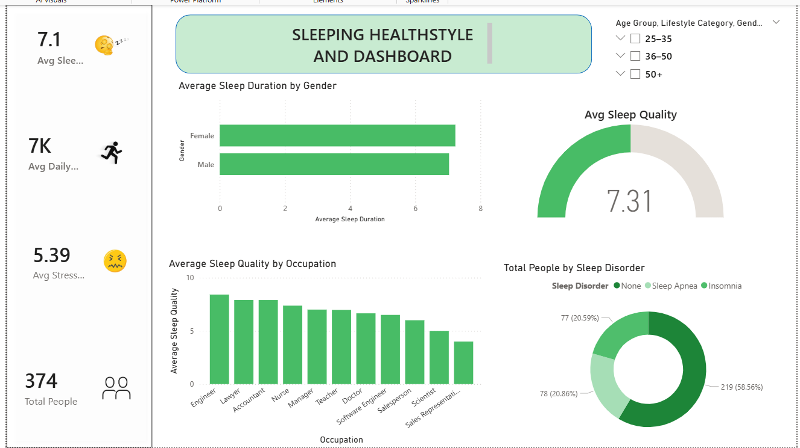

# 💤 Sleep Health & Lifestyle Dashboard


## 📌 Project Overview

The **Sleep Health & Lifestyle Dashboard** is an interactive Power BI project designed to analyze how lifestyle factors influence sleep quality and overall health.

This dashboard enables users to explore patterns in sleep duration, stress levels, physical activity, and BMI through dynamic visualizations.


## 🎯 Business Objectives

* Analyze sleep duration and quality trends
* Identify lifestyle factors affecting sleep
* Compare stress levels vs sleep patterns
* Provide actionable health insights through visualization

---

## 🛠️ Tools & Technologies

* **Power BI Desktop**
* **Data Cleaning & Transformation**
* **DAX Measures**
* **Data Visualization**
* **Excel / CSV Dataset**

---

## 📊 Dashboard Preview




---

## 🔍 Key Insights

* Individuals with higher physical activity tend to have better sleep quality
* Increased stress levels correlate with reduced sleep duration
* BMI category shows noticeable variation across age groups
* Sleep disorders are more common in high-stress segments

---

## 📁 Repository Structure

```
Sleep-Health-PowerBI-Project/
│
├── Sleep_Health_Lifestyle_Dashboard.pbix
├── dashboard_preview.png
└── README.md
```

---

## 🚀 How to Use

1. Download the `.pbix` file from this repository
2. Open using **Power BI Desktop**
3. Interact with filters and visuals
4. Explore insights from the dashboard

---

## 💡 Skills Demonstrated

* Data Cleaning
* Data Modeling
* DAX Calculations
* Interactive Dashboard Design
* Business Insight Generation

---

## 👨‍💻 Author

**Chandu**
🎯 Aspiring Data Analyst
📊 Power BI | SQL | Data Analytics

